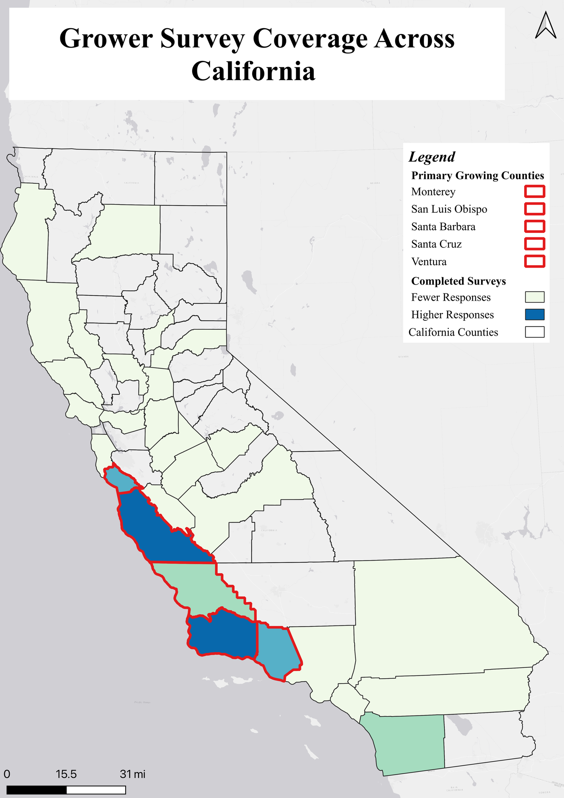

This is a coverage map, not a results map. It shows *where* growers responded to
the statewide mail survey behind my thesis, shaded by how many responses came
from each of California's five main strawberry-growing counties: Monterey, San
Luis Obispo, Santa Barbara, Santa Cruz, and Ventura. Read it as a description of
the sample, not as a finding about disposal behavior.

The map answers one question up front for anyone reading the thesis: who
answered, and from where. It sets the geographic context before any analysis,
and makes clear that the survey reached the counties where the crop actually
grows.

Built in QGIS from the survey response records.

<!-- Source figure: projects/thesis/defense-jul8/figures/survey-coverage-map.png
(deck labels it "sample description, not a map of the finding"). No response
counts or RDS numbers are shown, so no unpublished results are exposed. -->
