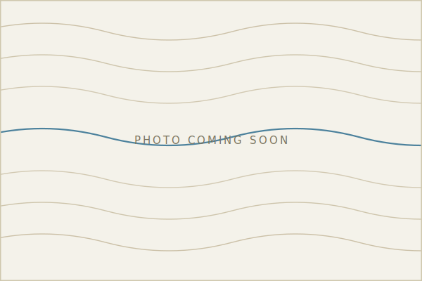
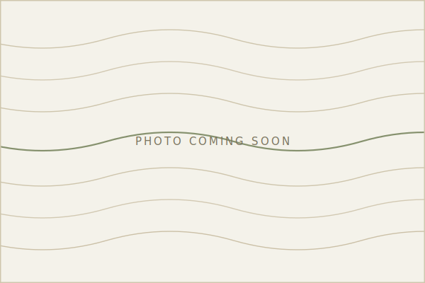
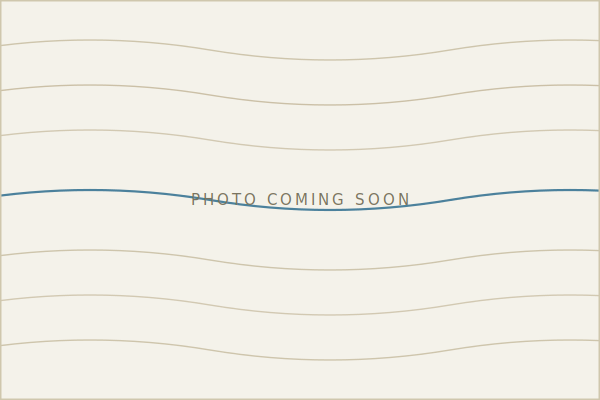

Placeholders for now. Drop your real images into `assets/photos/` and
swap the filenames below (jpg or png both work).

::: {layout-ncol=3}
{group="gallery"}

{group="gallery"}

{group="gallery"}
:::
